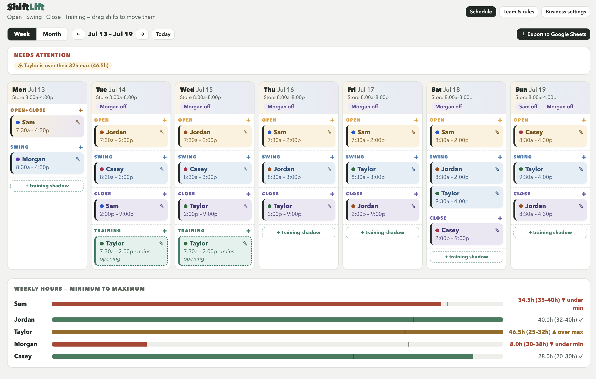
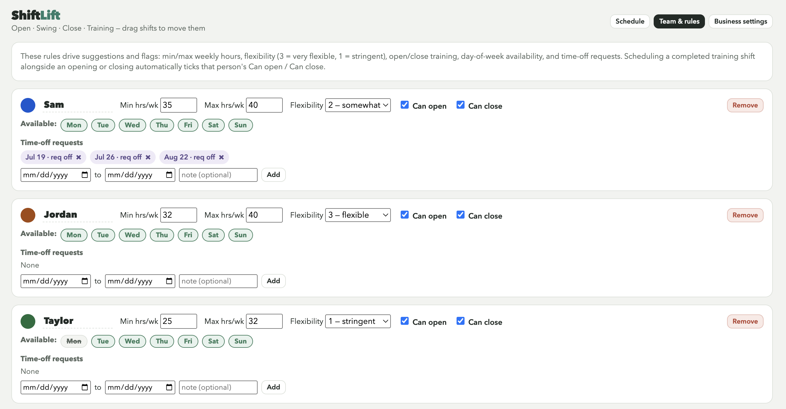
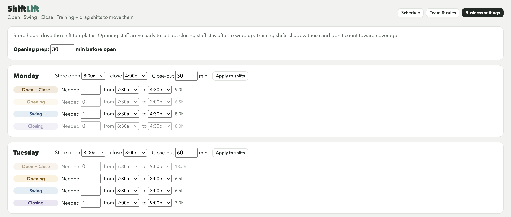

# ShiftLift

**A shift scheduler for independent cafés that understood who can open, close, and hold keys.**

Built, shipped to production, run as a private beta with a real restaurant — and then shut
down deliberately when the pricing floor turned out to be zero. The code, the strategy, and
the post-mortem are all here.

> **Status: archived (September 2026).** No longer developed, no longer sold. The interactive
> demo below runs entirely client-side and needs no backend.

### ▶ [Try the interactive demo](https://kgoyal94.github.io/team-scheduler/)

Runs entirely in your browser on seeded demo data — drag shifts between days, watch the
coverage gaps and hour violations update live, open the suggestion engine, export to Excel.
Nothing to install, no sign-up, no server.

---

## What it looked like

**The schedule board** — a week of coverage, with staffing gaps and hour-limit breaches
surfaced as you build:



**Team & rules** — the constraints that drive suggestions: weekly hour bounds, flexibility,
day availability, time-off, and the open/close certifications:



**Business settings** — store hours per day generate the shift templates, so coverage needs
are derived rather than hand-entered:



---

## The idea

Most scheduling tools treat employees as interchangeable hours. Cafés don't work that way:
**only some people can open, only some can close, and only some hold keys.** Put the wrong
person on a Tuesday open and the store doesn't open.

ShiftLift made certification a first-class scheduling constraint:

- **Coverage by shift type** — `open`, `swing`, `close`, and `full` (open+close in one). Store
  hours in Business Settings generate each day's needs; unmet needs show as gaps.
- **Certification-aware assignment** — an employee carries `canOpen` / `canClose`. Uncertified
  staff can't be assigned to those slots, and the board says so.
- **Auto-certification from shadow shifts** — the differentiator. A `training` shift that
  shadows a real open or close doesn't count toward coverage, but completing it automatically
  grants the certification. Training a new closer became a scheduling action rather than a
  spreadsheet someone forgets to update.
- **Explainable suggestions** — `rankCandidates` returns scored candidates *with reasons*,
  plus an explicit "ruled out, and why" list. The manager sees the reasoning, not a black box.
- **Override with a paper trail** — any rule can be overridden, but the conflict is named, a
  reason is captured, and the shift is marked.
- **Hour bounds** — per-employee weekly min/max drive under/over flags and candidate ranking.
- **Excel export** — because the schedule still had to get printed and taped to a wall.

## Stack

| | |
|---|---|
| Framework | Next.js 15 (App Router), React 19, TypeScript |
| Data + auth | Supabase (Postgres + magic-link Auth), server-side email allowlist |
| Hosting | Vercel (git-connected, auto-deploy on `main`) |
| Styling | Inline styles over a design-token object (`src/lib/tokens.ts`) — no Tailwind |
| Export | `xlsx-js-style` |

The architecture's one firm rule: **`src/domain/` is pure.** No React, no Supabase, no I/O —
just functions over plain data. Coverage math, the rules engine, and the certification logic
live there and are independently readable. UI and data layers import from domain, never the
reverse. That constraint existed for a human reason: two people were building this at once,
and a pure domain layer is what let them work without colliding.

```
src/
├── app/           # Next.js routes, auth callback, middleware
├── components/    # schedule/ · team/ · settings/ · ui/
├── domain/        # PURE logic: coverage, rules, training, time
├── data/          # Supabase persistence, one module per entity
├── export/        # Excel workbook builder
└── lib/           # design tokens, constants
supabase/migrations/
docs/index.html    # the original single-file prototype → now the demo
```

## Running it

The demo needs nothing. The full app needs a Supabase project:

```bash
npm install
cp .env.example .env.local   # add your Supabase URL + anon key
npm run dev
```

First sign-in bootstraps a demo business with five employees and a seeded week.

---

## Why it was shut down

This is the part worth reading.

ShiftLift reached production and ran as a private beta with a real independent restaurant —
where our design partner both co-owns this project and works on the floor. The highest-motivation
customer the product would ever get.

**It was used, genuinely, for about two weeks — and then use stopped and nobody ever paid.**
Pulling the production database at teardown showed the real staff roster entered in place of the
demo data, and 141 shifts covering seven weeks, built across four working sessions between
August 8 and August 23 — including schedules set two weeks into the future. Rule overrides,
time-off, and availability blocks all got used. Then it went quiet, three weeks before shutdown.

One number in that export matters more than the rest. **The certification engine — the
differentiator, and the entire justification for charging anything — was used twice in 141
shifts.** What got used was ordinary scheduling. What we were selling sat untouched.

Three findings, in increasing order of how much they mattered:

1. **They already had a scheduler** — an incumbent tool, already paid for, already set up.
2. **They didn't use that either.** A scheduler that validates against labor rules creates a
   written record of every place a small operator is out of compliance — and a tool that
   documents your exposure is a tool you stop opening. The real incumbent wasn't software at
   all. It was paper, a spreadsheet, and a group text.
3. **The incumbent gives scheduling away for free** — up to 30 employees at one location,
   which is larger than every café in the stated beachhead. Our list price was $29/location/month.

Point 3 is the one that ends it. Willingness to pay for *scheduling* at a single-location indie
café is approximately zero, because the category leader has priced it at zero to acquire
accounts for payroll and POS upsells. The certification engine is a genuine differentiator, but
a differentiator on top of a free commodity is a feature, not a business — and we had no
adjacent product to upsell into.

Two things we got right, and one we got wrong:

- **Right:** we shipped a real, working, deployed product in weeks instead of months.
- **Right:** we ran the stall as a diagnosis instead of assuming we needed more features. The
  finding was a *market* finding, and more features would have buried it.
- **Wrong:** we benchmarked pricing against the incumbent's paid tier when our own competitive
  analysis had already written down that the real default was "Google Sheets and group texts."
  We wrote down the right answer and then priced against the wrong anchor. A single "what does
  the free tier of the leader actually include?" check would have surfaced the $0 floor before
  any code was written.

The full write-up is in [`docs/post-mortem.md`](docs/post-mortem.md). The product strategy as
it stood — competitive landscape, blue-ocean analysis, roadmap — is preserved unedited in
[`STRATEGY.md`](STRATEGY.md), including the pricing reasoning that turned out to be wrong.

## Credits

Built by [Kuhuk Goyal](https://github.com/kgoyal94) and Alex Law — product/platform and
domain expertise respectively. A [Reborn Industries](https://rebornindustries.co) project.

## License

MIT — see [LICENSE](LICENSE).
